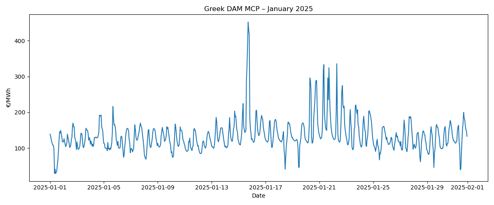
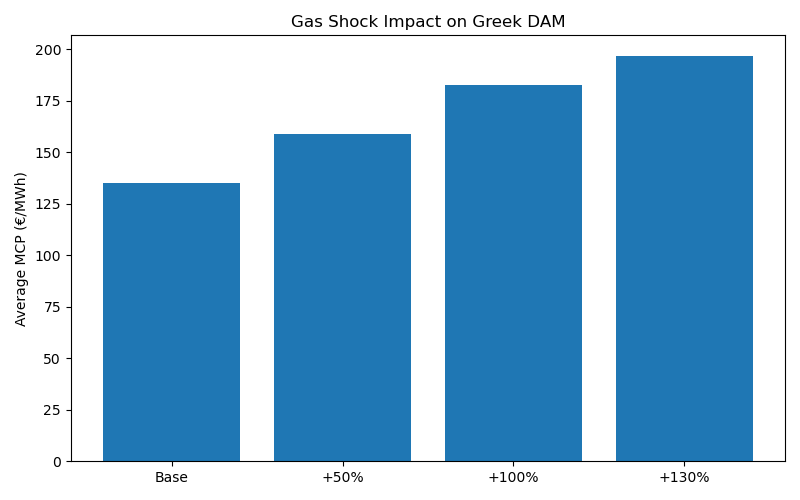
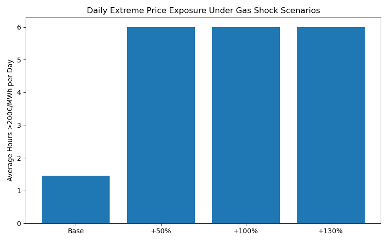
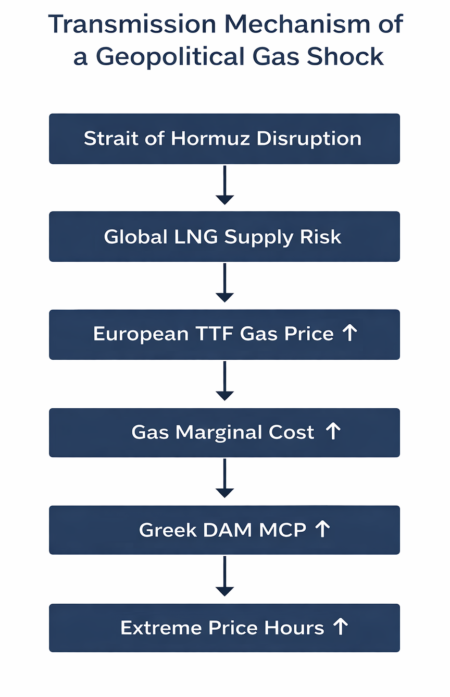

# Greek DAM Gas Shock Stress Test  
## Sensitivity Analysis Under a Hormuz Disruption Scenario

---

## 1. Research Question

How sensitive is the Greek Day-Ahead Market (DAM) to a severe natural gas price shock triggered by a geopolitical disruption, such as a prolonged closure of the Strait of Hormuz?

This project evaluates how such a shock could impact:

- The average wholesale electricity price (MCP)
- The frequency of extreme price events

---

## 2. Data

- Hourly Greek DAM Market Clearing Price (MCP)
- January 2025 (744 hourly observations)
- Source: HEnEx DAM Results
- Bidding Zone: Mainland Greece

---

## 3. Baseline Market Behavior

The following figure shows the hourly MCP for January 2025.

The market exhibits significant volatility, including multiple high-price spike events exceeding 200 €/MWh and a maximum above 450 €/MWh.

Baseline metrics:

- Average MCP: 135 €/MWh
- Extreme hours (>200 €/MWh): 45 hours (~1.5 hours/day)

---

## 4. Methodology

1. Gas-driven hours were approximated using a statistical proxy:
   - Top 25% highest MCP hours (75th percentile threshold).

2. Stress-test scenarios were applied to these hours:

   - +50% gas price shock (moderate)
   - +100% gas price shock (severe)
   - +130% gas price shock (extreme scenario based on market stress estimates such as Goldman Sachs)

3. Impact was measured on:
   - Average monthly MCP
   - Average daily hours above 200 €/MWh

This is a stress test, not a price forecast.

---

## 5. Impact on Average MCP

| Scenario | Average MCP (€/MWh) |
|-----------|---------------------|
| Base      | 135 |
| +50%      | 159 |
| +100%     | 183 |
| +130%     | 197 |

Under the extreme +130% gas shock scenario, the average DAM price increases by:

**+45.7%**

This demonstrates substantial structural exposure of the Greek wholesale electricity market to gas price shocks.

---

## 6. Impact on Extreme Price Exposure

Average daily hours above 200 €/MWh:

- Base scenario: ~1.5 hours/day  
- Extreme (+130%) scenario: ~6 hours/day  

Even a moderate +50% gas shock quadruples the frequency of high-price hours.

The most significant effect of the shock is not only on average prices, but on the amplification of extreme price events.

---

## 7. Shock Transmission Mechanism

This diagram illustrates the transmission channel:

Strait of Hormuz disruption  
→ Global LNG supply risk  
→ European TTF gas price increase  
→ Gas marginal cost increase  
→ Greek DAM MCP increase  
→ Amplification of extreme price hours  

---

## 8. Interpretation

The Greek electricity market shows meaningful structural dependence on natural gas.

In extreme geopolitical stress scenarios:

- Wholesale electricity prices increase materially
- Extreme price volatility intensifies
- Market risk exposure expands significantly

The amplification of high-price hours suggests increased volatility, risk premiums, and potential downstream impacts on retail tariffs and industrial consumers.

---

## 9. Limitations

- Gas-driven hours identified via statistical proxy (top 25% MCP)
- No direct marginal unit data used
- Linear shock application assumption
- Single-month analysis

Future improvements may include:

- Direct marginal fuel identification
- Load correlation analysis
- RES penetration sensitivity
- Multi-month stress simulations

---

## Project Structure

greek-dam-gas-shock-stress-test/
│
├── figures/
│   ├── 01_mcp_timeseries.png
│   ├── 02_average_mcp_scenarios.png
│   ├── 03_daily_extreme_hours.png
│   └── 04_shock_transmission_mechanism.png
│
├── notebooks/
│   └── hormuz_gas_shock.ipynb
│
└── README.md
